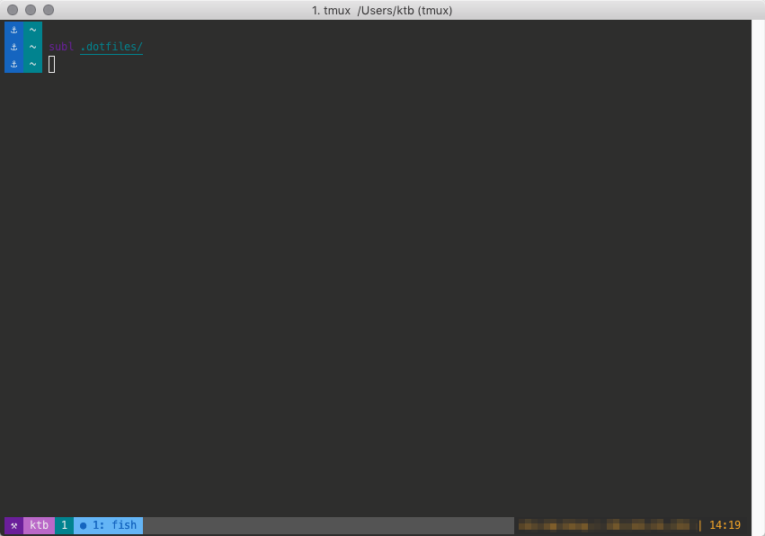

# [tmux](https://tmux.github.io) config

tmux config managed by [vcsh](https://github.com/RichiH/vcsh) and [myrepos](https://github.com/joeyh/myrepos), based on [Andy Schwartzmeyer](https://schwartzmeyer.com/)’s [dotfiles implementation](https://github.com/andschwa/dotfiles).

## Configuration

[View full configuration](https://github.com/benkutil/dotfiles-tmux/blob/vcsh/.tmux.conf)



```tmux.conf
# THEME
set -g status-bg brightblack
set -g status-fg brightwhite
set -g window-status-current-bg brightblue
set -g window-status-current-fg blue
set -g window-status-current-attr bold
setw -g window-status-format " #I: #W "
setw -g window-status-current-format " ● #I: #W "
set -g status-interval 60
set -g status-left-length 70
set -g status-left "#[bg=magenta,fg=white] ⚒ #[bg=brightmagenta,fg=white] #(whoami) #[bg=cyan,fg=white] #S "
set -g status-right '#[fg=yellow,bg=black] #h | #(curl -4 icanhazip.com) | %H:%M '
```
